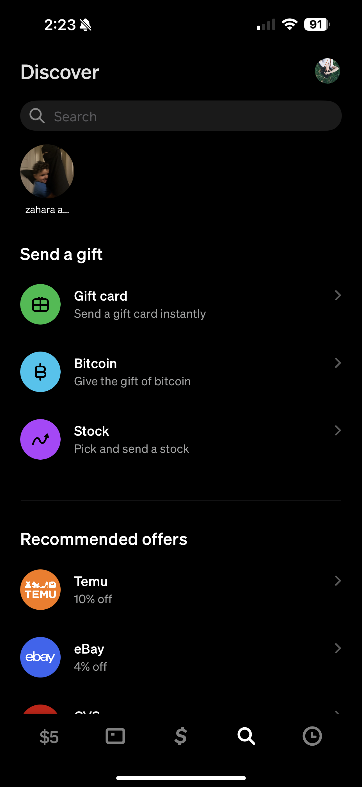

> [!NOTE]  
> This is a very outdated version of our clone. We Recommend using the V5 CA Clone as it has all the animations and it is 1:1
# CA Clone V2

Experience the look and feel of the original Cash App interface with this V2 clone, faithfully recreated for educational purposes. As the official app has evolved significantly, this version offers developers and learners a chance to explore the earlier UI design and mobile development techniques in a hands-on way.

| Page | V2 | V5 |
| ------------- | ------------- | ------------- |
| Home Page  |  |   |
| Money Page  |   |   |
| Activity Page  |   |   |
| Card Page  | ❌ Not Included   |   |
| Discover Page  | ❌ Not Included  |   |
| Profile Page  | ❌ Not Included  |   |
| Mode Menu  | ❌ Not Included  | ✅ Included |
| Send/Receive  | ❌ Not Included  | ✅ Included  |
| Linkables | ❌ Not Included  | ✅ Included  |

## Installation

### Windows & macOS:

#### 1. Get Sideloadly from: https://sideloadly.io/
- Select the correct version for your operating system.

#### 2. Install App

- Open Sideloadly & connect your phone to your computer via USB.
> [!TIP]
> To enable Wi-Fi sideloading your iDevice, please make sure your computer & iOS device are connected to the same network. Then you will need to initially connect your device via USB and follow these instructions depending on your OS:
> 
> macOS Catalina and up: Finder > Select your iDevice under 'Locations' > General > Enable "Show this iDevice when on Wi-Fi" option > Sync & Done.
>
> macOS Mojave and below: Open iTunes > Connected Device > Summary > Options > Enable "Sync with this iDevice over Wi-Fi" option > Sync & Done.
>
> Windows: To enable Wi-Fi sideloading your iDevice, please make sure your computer & iOS device are connected to the same network. Then you will need to initially connect your device via USB and enable Wi-fi sync in: iTunes > Connected Device > Summary > Options > Sync with this iDevice over Wi-Fi > Sync & Done.
- Select your phone in the iDevice windows.
- Enter your Apple ID in the Apple account field. Password will be asked later.
- Drag & drop the .IPA to sideloadly.
- Click Start and enter the password. The process might take several minutes.

### iOS (No PC or iTunes):

#### Scarlet:
> [!NOTE]  
> Head over to
[Scarlet Repository](https://github.com/ScarletApp/Install-Scarlet-iOS?tab=readme-ov-file) for instructions on how to install.

## App Refresh

- Unfortunately, apps that have been installed using non-developer Apple IDs are only valid for 7 days. After 7 days, the app will no longer open (you'll see an error that says app is no longer available).
- In order to refresh the app, you must connect your phone to your Mac/PC (via USB or Wi-fi) and reinstall it (repeat the installation process).
- DO NOT delete the current app or you will lose all app's data.

## Troubleshooting
See [Sideloadly - FAQ](https://sideloadly.io/#faq)
